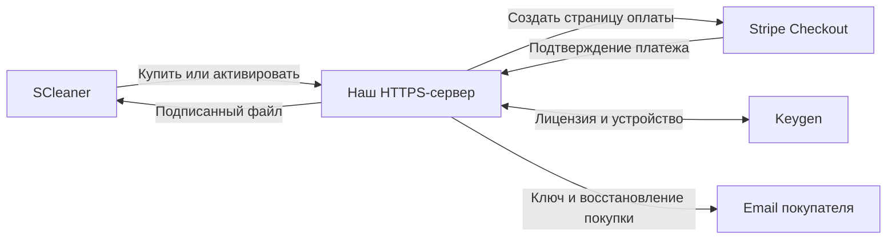

# Подключение Stripe и Keygen для публичного SCleaner Pro

Подготовлено 8 сентября 2026 года. Это проект подключения, а не уже развёрнутый
production-сервис. Текущий `scleaner_server` остаётся локальным тестовым сервером.
Настройки ниже ещё не читаются текущим кодом; реальные аккаунты не подключены.

## Разделение ответственности

Stripe принимает оплату. Keygen хранит лицензии, права и активации устройств.
Наш сервер связывает заказ с лицензией, обрабатывает подтверждения платежей,
отправляет письмо покупателю и обслуживает активацию/перенос/восстановление.
Приложение проверяет подписанный Keygen файл локально и открывает разрешённые функции.
Официальная схема интеграции: [Keygen + Stripe](https://keygen.sh/integrate/stripe/).

Предлагаемая модель: разовая покупка на один ПК, бессрочное право использования
купленной основной версии. Цена, включённые версии и срок автономной работы
фиксируются в условиях продажи до запуска. Будущие Pro-функции сначала должны
быть реализованы: сейчас в интерфейсе они отмечены «В разработке».

## 1. Аккаунт Stripe

В [Stripe Dashboard](https://dashboard.stripe.com/) зарегистрировать продавца
из Польши, пройти проверку бизнеса и подключить реквизиты для выплат. Заполнить
название продукта, сайт и контакт поддержки. Доступ к live mode требует
[активации сервиса](https://docs.stripe.com/get-started/account/set-up).

В live-окружении создать продукт SCleaner Pro и разовую цену. Сохранить ID цены
`price_…`. На нашем сервере этот ID связывается с конкретной политикой Keygen;
покупатель не выбирает произвольную цену, срок или права через параметры запроса.

После развёртывания HTTPS-сервера создать webhook endpoint с его реальным адресом
`/webhooks/stripe`. Включить `checkout.session.completed` и
`checkout.session.async_payment_succeeded`, а также нужные события возвратов и споров.
Секрет подписи endpoint хранить отдельно от API-ключа Stripe.

Тестовые цены, ключи и endpoint secrets не переносить в live-конфигурацию.
Секреты хранить на сервере в хранилище секретов; права ключа ограничить необходимыми
операциями. См. [ключи Stripe](https://docs.stripe.com/keys).

## 2. Аккаунт Keygen

В [Keygen Dashboard](https://app.keygen.sh/) создать product SCleaner и политику
для платного выпуска. Предлагаемые настройки политики:

| Настройка | Значение | Смысл |
| --- | --- | --- |
| `duration` | `null` | Само купленное право не истекает |
| `strict` | `true` | Проверять ограничения активации |
| `floating` | `false` | Лицензия привязана к одному устройству |
| `maxMachines` | `1` | Один активированный ПК |
| `requireFingerprintScope` | `true` | Проверять идентификатор устройства |
| `requireProductScope` | `true` | Проверять принадлежность продукту |
| `protected` | `true` | Создание платных лицензий контролирует сервер |

Значение `maxMachines` нужно использовать вместе с `strict`.
Подробности: [политики Keygen](https://keygen.sh/docs/api/policies/).

Права вроде `SCHEDULED_CLEANING`, `PROFILES` и `CUSTOM_RULES` — предлагаемые коды
наших будущих возможностей. Версию, на которую распространяется покупка, связывать
с разрешённой политикой/подписанными данными; не хранить это право только в настройках ПК.

Получить account ID, product ID, policy ID, открытый ключ проверки и серверный
API token с необходимыми правами. Для испытаний использовать отдельное изолированное
окружение или аккаунт. [Изоляция окружений Keygen](https://keygen.sh/docs/api/environments/)
не заменяет проверку продукта и политики в самом приложении.

## 3. Наш production-сервер

Развернуть отдельное Python API за HTTPS на собственном домене. Для общего доступа
нужны production ASGI-сервер, постоянная база заказов (предлагается PostgreSQL),
фоновая обработка событий, отправка писем, резервные копии и наблюдение за ошибками.
Текущий `http.server` на 127.0.0.1 служит только для локальных испытаний.

Предлагаемые имена конфигурации будущего сервера:

| Параметры | Где хранятся |
| --- | --- |
| `STRIPE_SECRET_KEY`, `STRIPE_WEBHOOK_SECRET` | Только серверное хранилище секретов |
| `STRIPE_PRO_PRICE_ID` | Конфигурация сервера, отдельно для live/test |
| `KEYGEN_API_TOKEN` | Только серверное хранилище секретов |
| `KEYGEN_ACCOUNT_ID`, `KEYGEN_PRODUCT_ID`, `KEYGEN_PRO_POLICY_ID`, `KEYGEN_ENVIRONMENT` | Конфигурация сервера |
| `DATABASE_URL`, ключ сервиса отправки писем | Только сервер |
| Адрес API, открытый ключ Keygen, разрешённые product/policy IDs | Публичная конфигурация приложения |

Admin, product и environment API tokens Keygen не включать в EXE. Открытый ключ
проверки можно распространять. См. [разделение ключей Keygen](https://keygen.sh/docs/api/security/).

## 4. Покупка и выдача лицензии

1. Сервер создаёт заказ и Stripe Checkout Session с серверной ценой, сохраняет
   соответствие заказа и сессии. Приложение открывает полученный URL в браузере.
2. Stripe присылает webhook. Сервер проверяет подпись и окружение, надёжно сохраняет
   событие и ставит его в очередь. Ответ об успешном приёме даётся после сохранения.
3. Обработчик проверяет актуальное состояние сессии, её связь с заказом и оплату.
   Страница «Спасибо» сама по себе не является подтверждением платежа.
4. Для оплаченного заказа обработчик создаёт лицензию нужной политики в Keygen.
   Сохраняет соответствие order ID, Stripe session/payment ID и Keygen license ID.
5. Покупатель видит ключ в защищённом результате своего заказа и получает письмо.
   Если Keygen или почта недоступны, заказ остаётся оплаченным, выдача повторяется
   в фоне; повторно платить покупателю не требуется.

Основа: [Stripe Checkout fulfillment](https://docs.stripe.com/checkout/fulfillment?payment-ui=stripe-hosted).
Keygen поддерживает [создание лицензий](https://keygen.sh/docs/creating-licenses/)
и [metadata для связи с заказом](https://keygen.sh/docs/api/metadata/).

Идемпотентность нужна по заказу и внешнему платежу, а не только по event ID.
Обработка заказа должна быть последовательной. При потере ответа на запрос
создания лицензии сначала сверять результат в Keygen; не создавать новую лицензию
вслепую. До выпуска подтвердить стратегию восстановления в интеграционном тесте:
сбой после создания лицензии, до сохранения её ID в нашей базе.

## 5. Активация в приложении

Пользователь вводит ключ. Сервер проверяет лицензию и покупку, регистрирует устройство
в Keygen, выполняет валидацию с нужными scopes и получает подписанный machine file.
Само получение подписанного файла не заменяет валидацию статуса лицензии.
Повторная активация того же устройства должна возвращать его существующую активацию.

SCleaner проверяет ожидаемый алгоритм, подпись, срок файла, данные лицензии,
идентификатор устройства, нужный продукт/политику/окружение и права. Только после
этого сохраняет файл и открывает функции. Для нашего Python-клиента подходит
поддерживаемый Keygen формат `base64+ed25519`; его данные читаемы, поэтому личные
сведения в подписанный файл включать без необходимости не следует.
См. [форматы и проверку Keygen](https://keygen.sh/docs/api/cryptography/).

Наша тестовая оболочка `{claims, signature}` не совместима с этим форматом.
Нужен отдельный проверяющий модуль; замены public key недостаточно. Сохраняется
интерфейс `LicenseManager.require(feature)` для обработчиков платных операций.

Сейчас идентификатор установки — UUID в файле; копирование всей папки клонирует его.
Для публичного обещания «один ПК» требуется продуманная идентификация Windows-устройства
и сценарий смены оборудования/переустановки. Подмену модифицированным клиентом нельзя
полностью исключить одной привязкой. Не отправлять на сервер содержимое сканирования.

## 6. Офлайн, перенос и возвраты

Ранее обсуждалась бессрочная работа офлайн. У неё есть следствие: старую копию
лицензии нельзя гарантированно отключить на компьютере без сети.

Для публичного выпуска предлагается отдельно рассмотреть machine file на 30 дней,
с заблаговременным автоматическим обновлением при доступной сети. Это срок проверки,
а не подписка: купленное право остаётся бессрочным. Такое изменение поведения должно
быть выбрано и отражено в условиях продукта, оно пока не реализовано.

Если требуется бессрочная автономная работа, можно оставить файл без срока, приняв
ограничения отзыва. Keygen документирует этот выбор через
[TTL файла устройства](https://keygen.sh/docs/api/machines/).

При переносе владелец подтверждает доступ к покупке (например, одноразовой ссылкой
на email), деактивирует старую машину и активирует новую. При полном успешном возврате
сервер приостанавливает лицензию. Частичный возврат и спор рассматриваются по отдельным
правилам; один запрос возврата ещё не доказывает успешное перечисление денег.
Состояния возвратов: [Stripe refunds](https://docs.stripe.com/refunds).

Уже выданный офлайн-файл может работать до своего срока даже после приостановки
лицензии или деактивации устройства. При ошибках связи не отключать существующий
действующий файл. После истечения файла завершать текущую операцию безопасно,
сохранять настройки Pro и доступ к Free/восстановлению; затем предлагать проверку связи.

## 7. Что предстоит изменить в репозитории

| Текущая часть | Изменение для prod |
| --- | --- |
| `scleaner_server/payments.py` | Явные независимые live/test настройки, production Stripe adapter |
| `scleaner_server/server.py` | Отдельный публичный API, постоянные заказы, очередь и восстановление обработки |
| `scleaner_server/signing.py` | Оставить для тестов; в prod выдавать файлы Keygen |
| `scleaner/licensing.py` | Проверка файлов Keygen и публичная production-конфигурация |
| `scleaner/activation.py` | Ключи Keygen вместо ограничения SCT-, обновление и управление активациями |
| `scleaner/pro_dialog.py` | Реальная цена/покупка, восстановление, перенос и понятные статусы |

До подключения live-платежей проверить эту же интеграцию с настоящими API Stripe
и Keygen в изолированном тестовом окружении: успешную/отложенную/отменённую оплату,
повтор и перестановку событий, потерю ответа Keygen, полный/частичный возврат,
недоступность провайдеров, перенос, переустановку и принятие только production-лицензий
в публичной сборке. Подпись установщика и условия распространения новых платных
компонентов тоже остаются отдельными задачами выпуска.

Ближайшие входные данные для подключения: аккаунты Stripe/Keygen, домен API,
хостинг, ID продуктов и политики, выбранное правило офлайн-работы. Секреты вводятся
непосредственно в серверное хранилище. Наличие этого документа не означает, что
настройки уже применены или приложение готово принимать реальные платежи.
